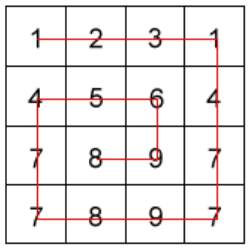

# Snail

### About

An algorithm that arranges the elements of a two dimensional array into a new one dimensional array traversing clockwise.

### Codewars Link

[Codewars - Snail](https://www.codewars.com/kata/521c2db8ddc89b9b7a0000c1)

### How To Execute

Create any two dimensional array, call the snail function, and pass it the two dimensional array.

### Input

```javascript
let array = [[1,2,3,1], [4,5,6,4], [7,8,9,7], [7,8,9,7]]

console.log(snail(array));
```

### Output

```javascript
1, 2, 3, 1, 4, 7, 7, 9, 8, 7, 7, 4, 5, 6, 9, 8
```

### Image



